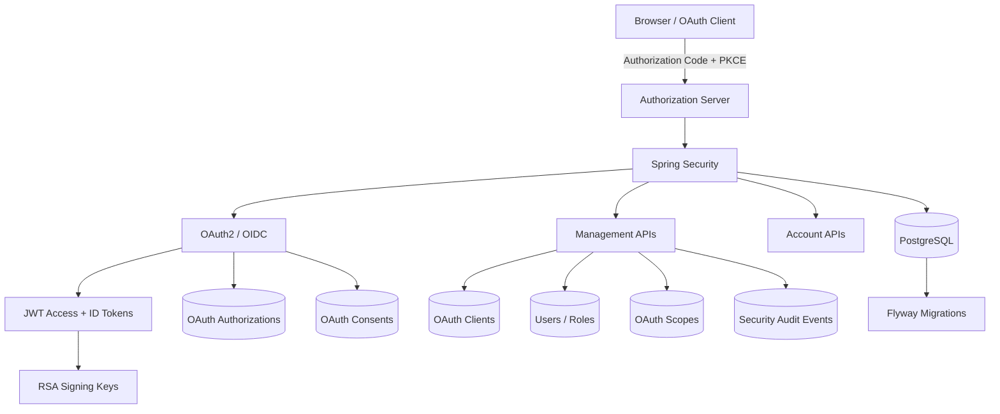

# Spring Boot OAuth2 Authorization Server

Production-oriented OAuth 2.1 and OpenID Connect authorization server template built with Spring Boot and Spring Security.

The project provides a practical foundation for running your own authorization server with persistent OAuth clients, users, scopes, authorizations, refresh tokens, administrative APIs, audit logging, token revocation, PKCE, OIDC, PostgreSQL, Flyway, Docker, and integration tests.

> This repository is a starting point for building an authorization server. Review the security, infrastructure, key-management, and deployment requirements for your environment before using it in production.

---

## Features

### OAuth 2 / OpenID Connect

- Authorization Code flow
- PKCE
- OpenID Connect
- ID Tokens
- UserInfo endpoint
- Refresh Tokens
- Refresh Token rotation
- Token revocation
- Token introspection
- JWT access tokens
- Persistent RSA signing keys
- OIDC discovery
- JWKS endpoint

### OAuth Client Management

- Public clients
- Confidential clients
- Secure generated client secrets
- Client secret rotation
- Redirect URI configuration
- Post-logout redirect URIs
- Configurable scopes
- Authorization consent
- PKCE enforcement
- Client deletion

### User Security

- Database-backed users
- Username or email authentication
- BCrypt/password encoding
- User registration
- Role-based authorization
- ADMIN and USER roles
- Account enable/disable
- Account lock/unlock
- Password change
- Administrative password reset
- Failed-login tracking
- Temporary account lockout
- Automatic lock expiration

### Authorization

- OAuth scopes
- Custom scope registry
- Scope enable/disable
- Role claims in access tokens
- ADMIN-protected management APIs

### Operations

- PostgreSQL
- Flyway migrations
- Persistent security audit log
- Actuator health endpoint
- Liveness probe
- Readiness probe
- Explicit CORS configuration
- Environment-driven configuration
- Docker
- Docker Compose
- GitHub Actions
- Testcontainers integration tests

---

## Technology

- Java 25
- Spring Boot 4
- Spring Security
- Spring Authorization Server
- Spring Data JPA
- PostgreSQL
- Flyway
- Maven
- Testcontainers
- Docker

---

## Architecture



More details are available in [`docs/architecture.md`](docs/architecture.md).

---

## OAuth Endpoints

Default local issuer:

```text
http://localhost:9000
```

Important protocol endpoints:

| Endpoint | Purpose |
|---|---|
| `/.well-known/openid-configuration` | OIDC discovery |
| `/oauth2/authorize` | Authorization endpoint |
| `/oauth2/token` | Token endpoint |
| `/oauth2/revoke` | Token revocation |
| `/oauth2/introspect` | Token introspection |
| `/oauth2/jwks` | JSON Web Key Set |
| `/userinfo` | OIDC UserInfo |
| `/login` | User authentication |

---

## Management APIs

Management endpoints require a bearer access token containing:

```text
ROLE_ADMIN
```

### OAuth Clients

```text
POST   /api/v1/clients
GET    /api/v1/clients
GET    /api/v1/clients/{clientId}
PUT    /api/v1/clients/{clientId}
DELETE /api/v1/clients/{clientId}

POST   /api/v1/clients/{clientId}/secret/rotate
```

### OAuth Scopes

```text
GET  /api/v1/scopes
POST /api/v1/scopes
PUT  /api/v1/scopes/{name}
```

### Users

```text
GET    /api/v1/users
GET    /api/v1/users/{userId}

PUT    /api/v1/users/{userId}/status

PUT    /api/v1/users/{userId}/roles/{roleName}
DELETE /api/v1/users/{userId}/roles/{roleName}

PUT    /api/v1/users/{userId}/password
```

### Security Audit

```text
GET /api/v1/audit-events
```

---

## Public Account APIs

### Register

```text
POST /api/v1/auth/register
```

Example:

```bash
curl -X POST http://localhost:9000/api/v1/auth/register \
  -H "Content-Type: application/json" \
  -d '{
    "username": "alice",
    "email": "alice@example.com",
    "password": "Password123!"
  }'
```

### Change Password

Requires an authenticated bearer token:

```text
POST /api/v1/account/password
```

---

# Local Development

## Requirements

Install:

- Java 25
- Docker
- Git

The project includes the Maven Wrapper, so installing Maven separately is optional.

Verify:

```bash
java -version
docker --version
docker compose version
```

---

## 1. Clone

```bash
git clone https://github.com/YOUR_USERNAME/spring-boot-oauth2-authorization-server.git
```

```bash
cd spring-boot-oauth2-authorization-server
```

---

## 2. Start PostgreSQL

```bash
docker compose up -d
```

Check:

```bash
docker compose ps
```

---

## 3. Generate development signing keys

```bash
chmod +x scripts/generate-dev-keys.sh
```

```bash
./scripts/generate-dev-keys.sh
```

The generated keys are stored under:

```text
.local/keys/
```

The directory is Git-ignored.

Never commit private signing keys.

---

## 4. Start development profile

```bash
SPRING_PROFILES_ACTIVE=dev ./mvnw spring-boot:run
```

The server starts on:

```text
http://localhost:9000
```

---

## Development Credentials

The `dev` profile creates demo data for local testing only.

User:

```text
username: user
password: password
```

OAuth client:

```text
client_id: demo-client
client_secret: demo-secret
```

These credentials are not created when running the production profile.

---

# Authorization Code + PKCE Example

Generate a PKCE verifier:

```bash
CODE_VERIFIER=$(openssl rand -base64 32 | tr '+/' '-_' | tr -d '=')
```

Generate the challenge:

```bash
CODE_CHALLENGE=$(
  printf '%s' "$CODE_VERIFIER" \
  | openssl dgst -sha256 -binary \
  | openssl base64 -A \
  | tr '+/' '-_' \
  | tr -d '='
)
```

Open the authorization request:

```bash
open "http://localhost:9000/oauth2/authorize?response_type=code&client_id=demo-client&redirect_uri=http%3A%2F%2F127.0.0.1%3A8081%2Fcallback&scope=openid%20profile%20email%20read&state=test123&nonce=test-nonce&code_challenge=$CODE_CHALLENGE&code_challenge_method=S256"
```

Authenticate using:

```text
user
password
```

Approve the requested scopes.

The browser will redirect to something similar to:

```text
http://127.0.0.1:8081/callback?code=AUTHORIZATION_CODE&state=test123
```

No application is required to be running on port `8081`; the browser may display an error page. Copy the authorization code from the URL.

Set it:

```bash
CODE='paste-authorization-code'
```

Exchange the code:

```bash
TOKEN_RESPONSE=$(curl -s \
  -u demo-client:demo-secret \
  -X POST http://localhost:9000/oauth2/token \
  --data-urlencode "grant_type=authorization_code" \
  --data-urlencode "code=$CODE" \
  --data-urlencode "redirect_uri=http://127.0.0.1:8081/callback" \
  --data-urlencode "code_verifier=$CODE_VERIFIER")
```

Inspect:

```bash
echo "$TOKEN_RESPONSE" | jq
```

Extract the access token:

```bash
ACCESS_TOKEN=$(echo "$TOKEN_RESPONSE" | jq -r '.access_token')
```

Extract the refresh token:

```bash
REFRESH_TOKEN=$(echo "$TOKEN_RESPONSE" | jq -r '.refresh_token')
```

Extract the ID token:

```bash
ID_TOKEN=$(echo "$TOKEN_RESPONSE" | jq -r '.id_token')
```

Export:

```bash
export ACCESS_TOKEN
export REFRESH_TOKEN
export ID_TOKEN
```

---

## UserInfo

```bash
curl -s \
  -H "Authorization: Bearer $ACCESS_TOKEN" \
  http://localhost:9000/userinfo \
  | jq
```

---

## Token Introspection

```bash
curl -s \
  -u demo-client:demo-secret \
  -X POST http://localhost:9000/oauth2/introspect \
  --data-urlencode "token=$ACCESS_TOKEN" \
  --data-urlencode "token_type_hint=access_token" \
  | jq
```

---

## Token Revocation

```bash
curl -i \
  -u demo-client:demo-secret \
  -X POST http://localhost:9000/oauth2/revoke \
  --data-urlencode "token=$ACCESS_TOKEN" \
  --data-urlencode "token_type_hint=access_token"
```

Sensitive management endpoints also check the authorization state, preventing a revoked access token from continuing to access management APIs merely because the JWT signature is still valid.

---

# PostgreSQL

Enter the development database:

```bash
docker exec -it oauth2-postgres \
  psql -U postgres -d oauth2_authorization_server
```

Flyway owns the schema.

Hibernate is configured to validate the schema rather than mutate it.

Do not use:

```properties
spring.jpa.hibernate.ddl-auto=update
```

for this project.

---

# Database Migrations

Migrations live under:

```text
src/main/resources/db/migration
```

Never edit an already-applied migration after it has been released.

For schema changes, create a new migration:

```text
V13__example_change.sql
```

---

# Configuration

Important environment variables:

| Variable | Description |
|---|---|
| `DB_URL` | PostgreSQL JDBC URL |
| `DB_USERNAME` | Database username |
| `DB_PASSWORD` | Database password |
| `AUTHORIZATION_SERVER_ISSUER` | Public issuer URL |
| `AUTHORIZATION_SERVER_CORS_ALLOWED_ORIGINS` | Allowed frontend origins |
| `AUTHORIZATION_SERVER_KEYS_PRIVATE_KEY` | RSA private key resource |
| `AUTHORIZATION_SERVER_KEYS_PUBLIC_KEY` | RSA public key resource |
| `LOGIN_MAX_FAILED_ATTEMPTS` | Login lock threshold |
| `LOGIN_LOCK_DURATION` | Temporary lock duration |
| `JAVA_TOOL_OPTIONS` | JVM runtime options |

See:

```text
.env.example
```

for an example.

---

# Production Docker

Copy the environment example:

```bash
cp .env.example .env
```

Set a strong database password and production values.

Make sure signing keys exist:

```bash
./scripts/generate-dev-keys.sh
```

For a real deployment, provide signing keys using an appropriate secure secret-management mechanism.

Start:

```bash
docker compose \
  --env-file .env \
  -f compose.production.yaml \
  up \
  --build \
  -d
```

Check:

```bash
docker compose \
  --env-file .env \
  -f compose.production.yaml \
  ps
```

Health:

```bash
curl http://localhost:9000/actuator/health
```

The production profile does not seed the development user or development OAuth client.

---

# Health Checks

```text
GET /actuator/health
GET /actuator/health/liveness
GET /actuator/health/readiness
```

Only health-related Actuator endpoints are exposed.

---

# Login Protection

Default configuration:

```text
Maximum failed attempts: 5
Temporary lock duration: 15 minutes
```

Temporary lock:

```text
account_non_locked = false
locked_until       = future timestamp
```

Administrative lock:

```text
account_non_locked = false
locked_until       = null
```

Administrative locks therefore do not expire automatically.

---

# Security Audit Events

Important security actions are persisted in:

```text
security_audit_events
```

Examples include:

```text
LOGIN_SUCCESS
LOGIN_FAILURE
PASSWORD_CHANGED
PASSWORD_RESET_BY_ADMIN
OAUTH_CLIENT_CREATED
OAUTH_CLIENT_UPDATED
OAUTH_CLIENT_SECRET_ROTATED
OAUTH_CLIENT_DELETED
```

Passwords, access tokens, refresh tokens, client secrets, and private signing keys must never be written to audit logs.

---

# Tests

Make sure Docker is running because integration tests use PostgreSQL Testcontainers.

```bash
docker info
```

Run all tests:

```bash
./mvnw clean verify
```

The test suite covers areas including:

- user registration
- user administration
- password management
- login lockout
- OAuth client management
- OAuth scope management
- Authorization Code
- PKCE
- refresh tokens
- refresh-token rotation
- OIDC
- UserInfo
- token revocation
- token introspection
- CORS
- operational security

---

# Continuous Integration

GitHub Actions runs:

```text
Maven clean verify
       ↓
Testcontainers / PostgreSQL
       ↓
Integration tests
       ↓
Docker image build
```

Workflow:

```text
.github/workflows/ci.yml
```

---

# Security Considerations

Before production deployment:

- use HTTPS
- use a stable HTTPS issuer
- store signing keys securely
- use strong database credentials
- configure exact CORS origins
- validate registered redirect URIs carefully
- restrict administrative APIs
- monitor security audit events
- back up the authorization database
- establish signing-key rotation procedures
- use short access-token lifetimes
- protect infrastructure and database access
- never enable development seed data in production

See [`SECURITY.md`](SECURITY.md).

---

# Project Status

This project is intended as a production-oriented template rather than a complete identity platform.

Applications may extend it with features such as:

- MFA
- passkeys
- email verification
- password recovery email workflows
- external identity providers
- organization/tenant management
- advanced consent UI
- dedicated key-management infrastructure
- distributed rate limiting
- security analytics

These features are intentionally outside the initial template scope.

---

# License

Licensed under the Apache License 2.0.

See [`LICENSE`](LICENSE).