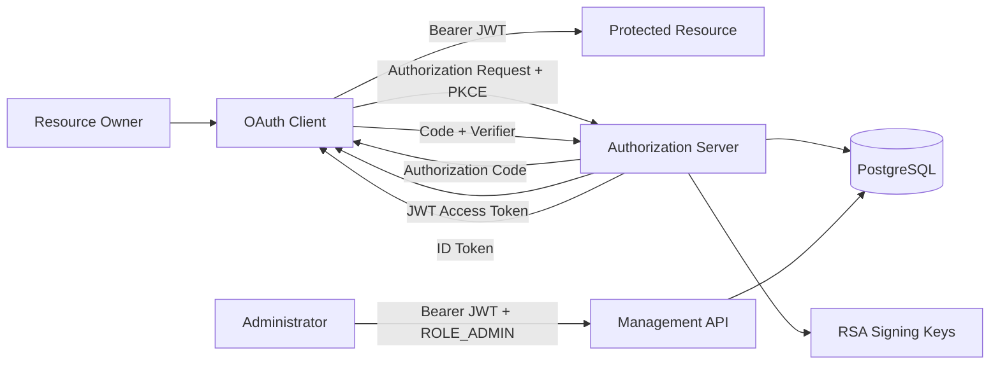

# Architecture

## Overview

The application acts as both:

1. an OAuth 2 / OpenID Connect Authorization Server
2. a protected administration application for managing users, scopes, and OAuth clients

The design keeps OAuth protocol persistence in PostgreSQL and uses RSA-signed JWT access and ID tokens.

## High-Level Architecture



## Security Filter Chains

The application uses separate Spring Security filter chains.

```text
Order 1
OAuth2 / OpenID Connect protocol endpoints

Order 2
Bearer-token protected management APIs

Order 3
Application login and public registration
```

This keeps browser login, protocol endpoints, and REST administration concerns separated.

## OAuth Persistence

OAuth data is stored using Spring Authorization Server JDBC components.

```text
oauth2_registered_client
oauth2_authorization
oauth2_authorization_consent
```

This persists:

- client registrations
- authorization codes
- access-token metadata
- refresh tokens
- OIDC ID-token metadata
- user consent

## Identity Persistence

Application identity data uses Spring Data JPA.

```text
users
roles
user_roles
```

Account state includes:

```text
enabled
account_non_expired
account_non_locked
credentials_non_expired
failed_login_attempts
locked_until
```

## OAuth Scope Registry

Custom OAuth scopes are stored in:

```text
oauth_scopes
```

Standard OIDC scopes are handled as built-in protocol scopes.

The registry controls which custom scopes can be assigned to newly created or updated OAuth clients.

## Token Model

Access tokens are JWTs signed using RSA.

```text
private.pem
     ↓ signs
JWT
     ↓ verifies
public.pem / JWKS
```

Access tokens contain:

```text
scope authorities
roles
subject
issuer
audience
timestamps
```

ID Tokens additionally expose scope-controlled identity information such as:

```text
preferred_username
email
```

## Token Revocation

JWT validation alone cannot normally detect server-side revocation until expiration.

For the authorization server's sensitive management APIs, token validation therefore consists of:

```text
JWT signature verification
        ↓
expiration verification
        ↓
authorization lookup
        ↓
OAuth2Authorization.Token.isActive()
```

This provides immediate revocation enforcement for management APIs.

External resource servers can choose between local JWT verification and introspection depending on their security and scalability requirements.

## Authentication Lockout

Login failure events are tracked.

```text
bad credentials
      ↓
failed_login_attempts
      ↓
threshold reached
      ↓
temporary lock
```

Temporary locks contain a `locked_until` value and expire automatically.

Administrative locks use:

```text
account_non_locked = false
locked_until = null
```

and therefore require administrative intervention.

## Signing Keys

Production signing keys are loaded from external PEM resources.

Private keys are never committed to Git.

The `test` profile uses an ephemeral test key so CI does not require production signing material.

## Schema Management

Flyway owns database schema changes.

Hibernate uses:

```text
ddl-auto=validate
```

and therefore validates rather than creates or updates the production schema.

## Audit

Security-relevant operations are written to:

```text
security_audit_events
```

Audit records must not contain credentials, raw tokens, client secrets, or private signing keys.

## Runtime

Production deployment:

```text
Reverse Proxy / Load Balancer
           ↓
Authorization Server container
           ↓
PostgreSQL
```

The issuer must represent the public external HTTPS URL seen by OAuth clients.

Forwarded-header handling is enabled for reverse-proxy deployments.